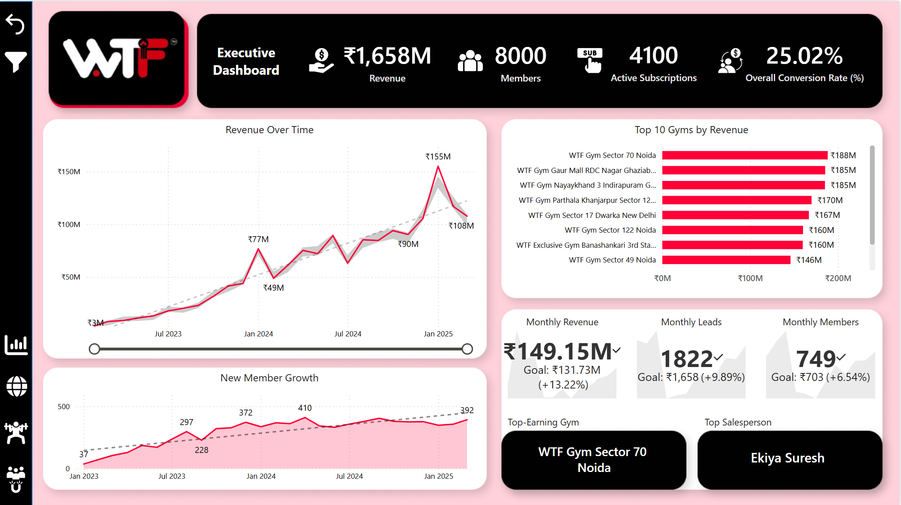
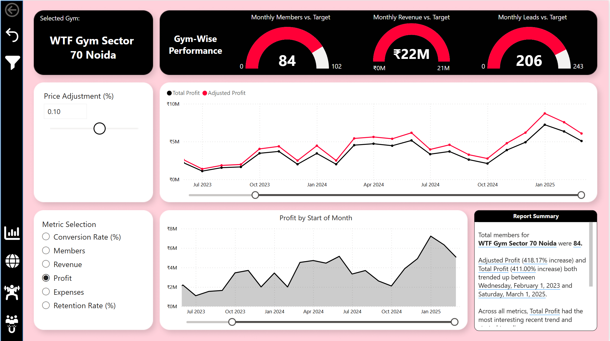
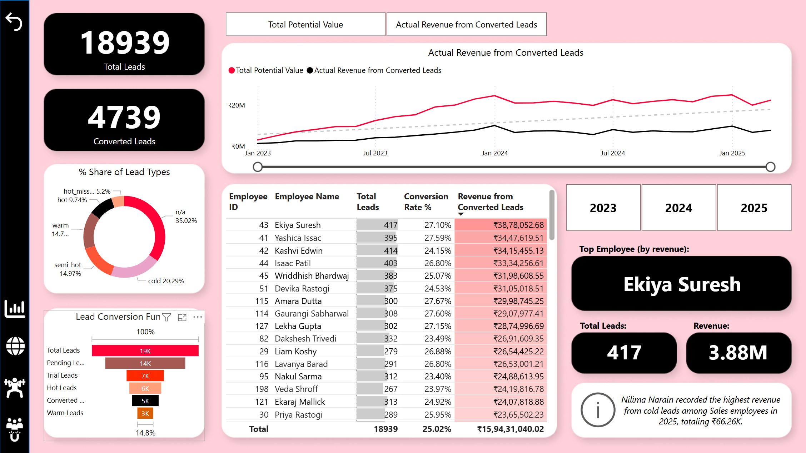

# 📊 WTF Gyms Analytics Dashboard


## Overview

This project showcases a comprehensive business intelligence solution for WTF Gyms, India's fastest-growing gym tech and fitness brand. The solution includes synthetic data generation using Python and a feature-rich Power BI dashboard that provides actionable insights for business growth and decision-making.

WTF Gyms is transforming India's fitness industry by modernizing local gyms through an accessible subscription model of just ₹599/month, making premium fitness experiences available to everyone.

## Project Components

### 1. Data Generation
- Custom Python script leveraging NumPy and Faker to generate realistic business data
- MySQL database integration for storing and managing the synthetic data
- Simulation of realistic business scenarios reflecting WTF Gyms' unique subscription model

### 2. Power BI Dashboard
The interactive dashboard consists of multiple pages:

- **Executive Dashboard**: High-level KPIs and performance metrics supporting WTF Gyms' expansion
- **Map View**: Geographic visualization of 20 current and planned gym locations across India
- **Gym-Wise Performance**: Detailed analysis of individual gym locations with target comparisons
- **Lead & Conversion Analytics**: Insights into sales pipeline and revenue generation

### 3. Technical Features

- **Data Modeling**: Star schema implementation with fact and dimension tables
- **Advanced Analytics**: 54+ custom DAX measures for comprehensive business metrics
- **Power Query Transformations**: Extensive data preparation and quality checks
- **UI/UX Design**: Custom-designed backgrounds using Figma following WTF Gyms' brand colors
- **Interactive Elements**: Dynamic filtering, parameters, and drill-through capabilities

## Dashboard Highlights

### Key Metrics Tracked
- ₹1,658M total revenue
- 8,000 members
- 4,100 active subscriptions
- 25.02% overall conversion rate

### Advanced Features
- Time-series analysis of revenue trends
- Geographic performance assessment
- Target vs. actual comparisons
- Lead funnel visualization
- Employee performance tracking

## Technologies Used

- **Data Generation**: Python (NumPy, Faker, Pandas)
- **Database**: MySQL
- **Data Visualization**: Power BI
- **UI Design**: Figma

## Getting Started

### Prerequisites
- Python 3.8+
- MySQL Server
- Power BI Desktop

### Installation

1. Clone this repository
```bash
git clone https://github.com/yourusername/wtf-gyms-analytics.git
cd wtf-gyms-analytics
```

2. Install required Python packages
```bash
pip install -r requirements.txt
```

3. Configure database connection in `scripts/config.py`

4. Generate sample data
```bash
python scripts/data_generation.py
```

5. Open the Power BI dashboard file in Power BI Desktop
```
powerbi/wtf_gyms_dashboard.pbix
```

## Dashboard Preview





## About WTF Gyms

WTF Gyms is at the forefront of transforming India's fitness industry through an accessible subscription model. As the country's fastest-growing gym tech and fitness brand, they provide premium facilities, personalized training, and state-of-the-art technology for just ₹599 a month. With 20 gyms currently open and 46 in the pipeline, they're expanding their vision of transformative fitness and community engagement across India.

Learn more: [WTF Gyms](https://wtfgyms.com/)

## License

This project is licensed under the MIT License - see the [LICENSE](LICENSE) file for details.

## Acknowledgments

- WTF Gyms for the inspiration and brand elements
- The Power BI community for technical insights and best practices
